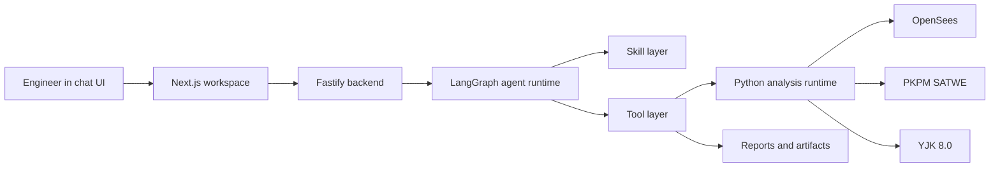

# StructureClaw

<p align="center">
  <strong>AI-assisted structural engineering workspace for AEC workflows.</strong>
</p>

<p align="center">
  <a href="https://www.npmjs.com/package/@structureclaw/structureclaw"></a>
  <a href="https://github.com/structureclaw/structureclaw/actions/workflows/backend-regression.yml"></a>
  <a href="https://github.com/structureclaw/structureclaw/actions/workflows/analysis-regression.yml"></a>
  
  <a href="./LICENSE"></a>
</p>

<p align="center">
  <a href="#quick-start">Quick Start</a>
  · <a href="#try-it-in-60-seconds">Try It</a>
  · <a href="#why-structureclaw">Why</a>
  · <a href="#engine-support">Engines</a>
  · <a href="#architecture">Architecture</a>
  · <a href="#documentation">Docs</a>
  · <a href="./README_CN.md">中文</a>
</p>

## Demo

https://github.com/user-attachments/assets/031fe757-551d-4775-ab3f-0411037ad5ae

## Quick Start

### Install from npm

```bash
npm install -g @structureclaw/structureclaw
sclaw doctor
sclaw start
```

Open the local workspace printed by `sclaw start`. `sclaw doctor` creates the runtime workspace, checks LLM settings, prepares SQLite, and installs the Python analysis environment when needed.

### Run from source

```bash
git clone https://github.com/structureclaw/structureclaw.git
cd structureclaw
./sclaw doctor
./sclaw start
./sclaw status
```

Windows PowerShell from source:

```powershell
node .\sclaw doctor
node .\sclaw start
node .\sclaw status
```

China mirror entrypoint:

```bash
sclaw_cn doctor
sclaw_cn start
```

## Try It In 60 Seconds

After the workspace opens, try:

```text
Model a two-story steel frame, 6 m by 4 m bay, 3.6 m story height, Q355 steel columns and beams, dead load 5 kN/m2 and live load 2 kN/m2. Build the model, run static analysis, check GB50017, and generate a short report.
```

Expected flow:

```text
draft model -> validate -> run analysis -> code-check -> report
```

Use OpenSees for a fully open local run. Select PKPM or YJK only when the corresponding commercial software and authorization are available on the machine.

## Why StructureClaw

StructureClaw turns a natural-language structural description into a traceable engineering workflow:

```text
describe -> draft model -> validate -> analyze -> code-check -> report
```

What makes it useful:

- **Chat-first modeling**: describe a frame, truss, portal frame, or generic structure and let the agent build a computable model.
- **Real analysis handoff**: run OpenSees, PKPM SATWE, or YJK through the same backend-hosted analysis contract.
- **Traceable engineering artifacts**: keep model drafts, validation results, tool calls, analysis outputs, checks, and reports visible.
- **Local-first runtime**: installed mode stores data in the user runtime directory instead of the package directory.
- **Extensible skills and tools**: combine built-in skills with user-local skills/tools under the runtime workspace.

## Engine Support

| Engine | Skill | Best for | Requirements |
|---|---|---|---|
| OpenSees | `opensees-*` | Open, repeatable static/dynamic/seismic/nonlinear analysis | Python analysis environment prepared by `sclaw doctor` |
| PKPM SATWE | `pkpm-static` | Commercial-engine static checks and SATWE comparison | Local PKPM installation, `JWSCYCLE.exe`, valid license |
| YJK 8.0 | `yjk-static` | YDB conversion, YJK static calculation, structured result extraction | Local YJK 8.0 installation, bundled Python 3.10, valid authorization |

Commercial engines are explicit selections and require local software installation. StructureClaw does not bundle PKPM or YJK.

## Architecture



Main directories:

- `frontend/`: Next.js 14 application
- `backend/`: Fastify API, agent/chat flows, Prisma integration, and analysis execution host
- `scripts/`: startup helpers and the `sclaw` / `sclaw_cn` CLI implementation
- `tests/`: regression runner (`node tests/runner.mjs ...`), install smoke, and CI-covered frontend checks (type-check, Vitest, lint) after native smoke
- `docs/`: user handbook and protocol references

## Runtime Modes

| Mode | Command | Data directory | Process model |
|---|---|---|---|
| npm install | `sclaw start` | user runtime directory, defaulting to `~/.structureclaw/` | backend serves the exported frontend in one process |
| source checkout | `./sclaw start` | user runtime directory, defaulting to `~/.structureclaw/` | backend and frontend run as development processes |
| Docker | `./sclaw docker-install` then `./sclaw docker-start` | Docker volumes / compose state | containerized stack |

Recommended local flow:

```bash
./sclaw doctor
./sclaw start
./sclaw status
```

China mirror flow (same subcommands, mirror defaults enabled):

```bash
./sclaw_cn doctor
./sclaw_cn start
./sclaw_cn status
```

Notes:

- SQLite is now the default local database. `./sclaw start` uses `~/.structureclaw/data/structureclaw.start.db`, and `./sclaw doctor` uses `~/.structureclaw/data/structureclaw.doctor.db` so preflight checks do not touch the active local runtime database.
- `./sclaw doctor` no longer requires a preinstalled system Python 3.12. It will ensure `uv` and prepare a virtual environment with Python 3.12 automatically when needed. On Windows, this automatic setup currently requires `winget`; if `winget` is unavailable, install `uv` manually before running `./sclaw doctor`.
- If your old local `.env` still points `DATABASE_URL` at a local PostgreSQL instance, `./sclaw doctor` and `./sclaw start` will auto-migrate that data into SQLite, rewrite `.env` to the SQLite default, and keep the original PostgreSQL URL in `POSTGRES_SOURCE_DATABASE_URL`.
- That first auto-migration also creates a local backup file like `.env.pre-sqlite-migration.<timestamp>.bak`.
- `sclaw_cn` defaults to China mirror settings when unset: `PIP_INDEX_URL=https://pypi.tuna.tsinghua.edu.cn/simple`, `NPM_CONFIG_REGISTRY=https://registry.npmmirror.com`, and Docker mirror prefix via `DOCKER_REGISTRY_MIRROR`.
- You can override mirror values in `.env` or shell environment (`PIP_INDEX_URL`, `NPM_CONFIG_REGISTRY`, `DOCKER_REGISTRY_MIRROR`, `APT_MIRROR`).

Useful follow-up commands for source checkouts:

```bash
./sclaw logs
./sclaw stop
# Requires a source checkout:
node tests/runner.mjs backend-regression
node tests/runner.mjs analysis-regression
```

Use the built-in CLI batch convert command to transform structure model JSON files and write a summary report:

```bash
./sclaw convert-batch --input-dir tmp/input --output-dir tmp/output --report tmp/report.json --target-format compact-1
```

Windows PowerShell:

```powershell
node .\sclaw doctor
node .\sclaw start
node .\sclaw status
node .\sclaw logs all --follow
node .\sclaw stop
```

### Windows / Docker Quick Start

Windows users can now start the full stack directly with Docker, which is the easiest path for beginners who do not want to install local Node.js and Python first.

Recommended steps:

1. Install and start Docker Desktop.
2. If Docker Desktop asks you to enable WSL 2 or required container features on first launch, follow the setup wizard and restart Docker Desktop.
3. Run the interactive Docker bootstrap command from the project root:

```powershell
node .\sclaw docker-install
```

For CI or scripted setup, use the non-interactive variant:

```powershell
node .\sclaw docker-install --non-interactive --llm-base-url https://api.openai.com/v1 --llm-api-key <your-key> --llm-model gpt-4.1
```

Once the stack is ready, the main entrypoints are:

- Frontend: `http://localhost:31416`
- Backend health check: `http://localhost:31415/health`
- Analysis routes: `http://localhost:31415/analyze`
- Database status page: `http://localhost:31416/console/database`

To stop the containers:

```bash
node .\sclaw docker-stop
```

Or:

```bash
docker compose down
```

## Configuration

StructureClaw 1.0 uses `settings.json` as the user-facing configuration file. `sclaw doctor` creates it, and the General Settings panel writes the same settings through the backend admin API.

Configuration resolution:

1. Runtime `settings.json`
2. Built-in defaults

Selected environment variables still participate as runtime fallbacks or directory controls. `PORT`, `FRONTEND_PORT`, and `NODE_ENV` are read when the corresponding setting is absent, and `SCLAW_DATA_DIR` changes the runtime directory used to locate `settings.json` and data files.

Important `settings.json` fields and sections:

- `server`: ports, host, request body limit
- `llm`: OpenAI-compatible base URL, model, API key, timeout, retries
- `database.url`: SQLite connection URL
- `logging`: application log level, LLM logging, log rotation
- `analysis`: Python runtime path, timeout, engine manifest path
- `storage`: reports directory and upload size
- `agent`: workspace root, checkpoints, shell-tool policy
- `pkpm`: SATWE/JWSCYCLE path and work directory
- `yjk`: install root, executable, bundled Python, work directory, version, timeout, headless mode

By default, `settings.json` lives in `~/.structureclaw/`. The `SCLAW_DATA_DIR` environment variable can override that runtime directory for tests or controlled deployments.

## API Entrypoints

Backend:

- `POST /api/v1/agent/run`
- `POST /api/v1/chat/message`
- `POST /api/v1/chat/stream`

Backend-hosted analysis:

- `POST /validate`
- `POST /convert`
- `POST /analyze`
- `POST /code-check`
- `GET /engines`

## Engineering Principles

- Skills are enhancement layers, not the only execution path.
- Unmatched selected skills fall back to generic no-skill modeling.
- User-visible content must support both English and Chinese.
- Keep module boundaries explicit across frontend/backend/analysis skills.

## Documentation

- English handbook: [docs/handbook.md](./docs/handbook.md)
- Chinese handbook: [docs/handbook_CN.md](./docs/handbook_CN.md)
- Documentation hub: [docs/README.md](./docs/README.md)
- English reference: [docs/reference.md](./docs/reference.md)
- Chinese reference: [docs/reference_CN.md](./docs/reference_CN.md)
- Chinese overview: [README_CN.md](./README_CN.md)
- Contribution guide: [CONTRIBUTING.md](./CONTRIBUTING.md)
- Roadmap: [ROADMAP.md](./ROADMAP.md)
- Security policy: [SECURITY.md](./SECURITY.md)

## Contributing

Please read [CONTRIBUTING.md](./CONTRIBUTING.md) and the organization-level [Code of Conduct](https://github.com/structureclaw/.github/blob/main/CODE_OF_CONDUCT.md) before opening a PR.

## License

MIT. See [LICENSE](./LICENSE).
