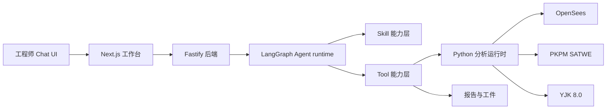

# StructureClaw

<p align="center">
  <strong>面向 AEC 场景的 AI 协同结构工程工作台。</strong>
</p>

<p align="center">
  <a href="https://www.npmjs.com/package/@structureclaw/structureclaw"></a>
  <a href="https://github.com/structureclaw/structureclaw/actions/workflows/backend-regression.yml"></a>
  <a href="https://github.com/structureclaw/structureclaw/actions/workflows/analysis-regression.yml"></a>
  
  <a href="./LICENSE"></a>
</p>

<p align="center">
  <a href="#快速启动">快速启动</a>
  · <a href="#60-秒试跑">试跑</a>
  · <a href="#为什么选择-structureclaw">为什么</a>
  · <a href="#引擎支持">引擎</a>
  · <a href="#架构概览">架构</a>
  · <a href="#文档入口">文档</a>
  · <a href="./README.md">English</a>
</p>

## Demo

https://github.com/user-attachments/assets/031fe757-551d-4775-ab3f-0411037ad5ae

## 快速启动

### npm 安装版

```bash
npm install -g @structureclaw/structureclaw
sclaw doctor
sclaw start
```

打开 `sclaw start` 打印出的本地工作台地址。`sclaw doctor` 会创建运行工作区、检查 LLM 配置、准备 SQLite，并在需要时安装 Python 分析环境。

### 源码开发版

```bash
git clone https://github.com/structureclaw/structureclaw.git
cd structureclaw
./sclaw doctor
./sclaw start
./sclaw status
```

Windows PowerShell 源码模式：

```powershell
node .\sclaw doctor
node .\sclaw start
node .\sclaw status
```

国内镜像入口：

```bash
sclaw_cn doctor
sclaw_cn start
```

## 60 秒试跑

打开工作台后，可以输入：

```text
建立一个两层钢框架，平面 6 m x 4 m，层高 3.6 m，柱梁均为 Q355 钢，恒载 5 kN/m2，活载 2 kN/m2。请生成模型，运行静力分析，按 GB50017 校核，并生成简短报告。
```

预期链路：

```text
模型草案 -> 校验 -> 计算分析 -> 规范校核 -> 报告
```

如果希望完全开源本地运行，请使用 OpenSees。只有在本机已安装并授权 PKPM 或 YJK 时，再选择对应商业引擎。

## 为什么选择 StructureClaw

StructureClaw 把自然语言结构描述变成可追踪的工程工作流：

```text
描述 -> 模型草案 -> 校验 -> 分析 -> 规范校核 -> 报告
```

核心价值：

- **Chat-first 建模**：描述框架、桁架、门式刚架或通用结构，由 agent 生成可计算模型。
- **真实分析交付**：通过同一后端分析契约调用 OpenSees、PKPM SATWE 或 YJK。
- **可追踪工程工件**：模型草案、校验结果、tool 调用、分析输出、校核和报告都可见。
- **本地优先运行**：安装版把数据写入用户运行目录，不污染 npm 包目录。
- **可扩展 skills/tools**：内置技能可与用户运行目录中的自定义技能和工具组合。

## 引擎支持

| 引擎 | Skill | 适用场景 | 依赖 |
|---|---|---|---|
| OpenSees | `opensees-*` | 开源、可复现的静力/动力/地震/非线性分析 | `sclaw doctor` 准备的 Python 分析环境 |
| PKPM SATWE | `pkpm-static` | 商业引擎静力复核与 SATWE 对比 | 本机 PKPM、`JWSCYCLE.exe`、有效授权 |
| YJK 8.0 | `yjk-static` | YDB 转换、YJK 静力计算、结构化结果抽取 | 本机 YJK 8.0、内置 Python 3.10、有效授权 |

商业引擎是显式选择项，需要本机软件安装。StructureClaw 不随包分发 PKPM 或 YJK。

## 架构概览



主要目录：

- `frontend/`：Next.js 14 前端
- `backend/`：Fastify API、Agent/Chat 编排、Prisma，以及分析执行宿主
- `scripts/`：启动脚本与 `sclaw` / `sclaw_cn` CLI 实现
- `tests/`：回归入口（`node tests/runner.mjs ...`）、安装冒烟，以及原生冒烟后在 CI 中执行的前端 type-check、Vitest 与 lint
- `docs/`：手册与协议参考文档

## 运行模式

| 模式 | 命令 | 数据目录 | 进程模型 |
|---|---|---|---|
| npm 安装版 | `sclaw start` | 用户运行目录，默认 `~/.structureclaw/` | 后端单进程托管导出的前端 |
| 源码开发版 | `./sclaw start` | 用户运行目录，默认 `~/.structureclaw/` | backend/frontend 以开发进程运行 |

推荐本地流程：

```bash
./sclaw doctor
./sclaw start
./sclaw status
```

国内镜像流程（子命令与 `sclaw` 一致，但默认启用国内镜像）：

```bash
./sclaw_cn doctor
./sclaw_cn start
./sclaw_cn status
```

补充说明：

- 本地默认数据库现在是 SQLite。`./sclaw start` 默认使用 `~/.structureclaw/data/structureclaw.start.db`，`./sclaw doctor` 默认使用 `~/.structureclaw/data/structureclaw.doctor.db`，这样预检不会碰当前实际运行库。
- `./sclaw doctor` 不再要求你预先安装系统级 Python 3.12。缺失时会先确保 `uv` 可用，并自动准备带 Python 3.12 的虚拟环境；在 Windows 上，如果系统未安装 `winget`，则会提示你手动安装 `uv`。
- 如果你原来的本地 `.env` 还把 `DATABASE_URL` 指向本地 PostgreSQL，`./sclaw doctor` 和 `./sclaw start` 会先自动迁移到 SQLite，再把 `.env` 改写成 SQLite 默认配置，同时把原 PostgreSQL 地址保留到 `POSTGRES_SOURCE_DATABASE_URL`。
- 第一次自动迁移时，还会生成一个类似 `.env.pre-sqlite-migration.<timestamp>.bak` 的本地备份文件。
- `sclaw_cn` 在未显式配置时会自动使用国内镜像默认值：`PIP_INDEX_URL=https://pypi.tuna.tsinghua.edu.cn/simple`、`NPM_CONFIG_REGISTRY=https://registry.npmmirror.com`。
- 你可以在 `.env` 或 shell 环境中覆盖镜像变量：`PIP_INDEX_URL`、`NPM_CONFIG_REGISTRY`、`APT_MIRROR`。

源码开发版常用后续命令：

```bash
./sclaw logs
./sclaw stop
# 需要源码开发版：
node tests/runner.mjs backend-regression
node tests/runner.mjs analysis-regression
```

使用 CLI 内建批量转换命令处理结构模型 JSON，并输出汇总报告：

```bash
./sclaw convert-batch --input-dir tmp/input --output-dir tmp/output --report tmp/report.json --target-format compact-1
```

Windows PowerShell：

```powershell
node .\sclaw doctor
node .\sclaw start
node .\sclaw status
node .\sclaw logs all --follow
node .\sclaw stop
```

## 配置

StructureClaw 1.0 以 `settings.json` 作为用户配置文件。`sclaw doctor` 会创建该文件，前端 General Settings 面板也会通过后端 admin API 写入同一份配置。

配置解析：

1. 运行时 `settings.json`
2. 内置默认值

部分环境变量仍会作为运行时兜底或目录控制参与解析。对应配置缺失时，后端会读取 `PORT`、`FRONTEND_PORT`、`NODE_ENV`；`SCLAW_DATA_DIR` 会改变用于查找 `settings.json` 和数据文件的运行目录。

重要 `settings.json` 字段和 section：

- `server`：端口、host、请求体大小
- `llm`：OpenAI-compatible base URL、模型、API key、超时、重试
- `database.url`：SQLite 连接地址
- `logging`：应用日志级别、LLM 日志、日志轮转
- `analysis`：Python 运行时路径、超时、引擎 manifest 路径
- `storage`：报告目录与上传大小
- `agent`：workspace root、checkpoint、shell tool 策略
- `pkpm`：SATWE/JWSCYCLE 路径与工作目录
- `yjk`：安装根目录、可执行文件、内置 Python、工作目录、版本、超时、headless mode

默认情况下，`settings.json` 位于 `~/.structureclaw/`。测试或受控部署可通过 `SCLAW_DATA_DIR` 覆盖运行目录。

## 主要 API 入口

后端：

- `POST /api/v1/agent/run`
- `POST /api/v1/chat/message`
- `POST /api/v1/chat/stream`

后端托管分析：

- `POST /validate`
- `POST /convert`
- `POST /analyze`
- `POST /code-check`
- `GET /engines`

## 核心原则

- Skill 是增强层，不是唯一执行路径。
- 已选技能未匹配时回退到通用 no-skill 建模。
- 所有用户可见内容必须支持中英文双语。
- 保持前端、后端、分析技能模块边界清晰。

## 文档入口

- 中文手册：[docs/handbook_CN.md](./docs/handbook_CN.md)
- 英文手册：[docs/handbook.md](./docs/handbook.md)
- 文档入口：[docs/README_CN.md](./docs/README_CN.md)
- 中文参考：[docs/reference_CN.md](./docs/reference_CN.md)
- 英文参考：[docs/reference.md](./docs/reference.md)
- 英文总览：[README.md](./README.md)
- 中文贡献指南：[CONTRIBUTING_CN.md](./CONTRIBUTING_CN.md)
- 路线图：[ROADMAP_CN.md](./ROADMAP_CN.md)
- 安全策略：[SECURITY_CN.md](./SECURITY_CN.md)

## 参与贡献

提交 PR 前请先阅读 [CONTRIBUTING_CN.md](./CONTRIBUTING_CN.md) 和组织级 [Code of Conduct](https://github.com/structureclaw/.github/blob/main/CODE_OF_CONDUCT.md)。

## 许可证

MIT，详见 [LICENSE](./LICENSE)。
