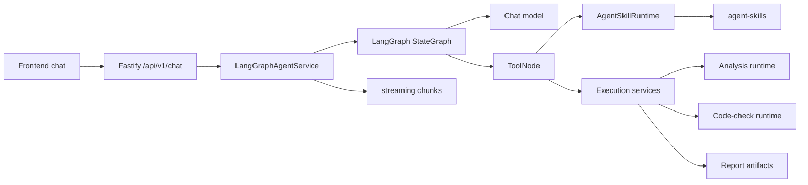

# Agent Architecture

This document describes the current StructureClaw 1.0.0 agent runtime. It is a code-aligned reference for contributors, not a planning document.

## 1. Runtime Shape

StructureClaw uses a capability-driven agent:

```text
Frontend chat UI
  -> Fastify chat API
  -> LangGraph ReAct agent
  -> registered tools
  -> skill runtime and backend execution services
  -> streamed assistant presentation
```

The agent is not mode-driven. A normal conversation can stay on the base LLM path, while engineering requests can activate skills and tools for draft extraction, validation, analysis, code checking, and reporting.



## 2. Public Entry Points

Current chat routes live in [backend/src/api/chat.ts](../backend/src/api/chat.ts):

- `POST /api/v1/chat/message`: synchronous chat execution.
- `POST /api/v1/chat/stream`: server-sent event streaming.
- `POST /api/v1/chat/stream/resume`: resume a paused interaction.
- Conversation snapshot and persistence routes are in the same module.

Agent capability and SkillHub routes live in [backend/src/api/agent.ts](../backend/src/api/agent.ts):

- `GET /api/v1/agent/skills`
- `GET /api/v1/agent/tools`
- `GET /api/v1/agent/capability-matrix`
- `GET /api/v1/agent/skillhub/search`
- `GET /api/v1/agent/skillhub/installed`
- `POST /api/v1/agent/skillhub/install`
- `POST /api/v1/agent/skillhub/enable`
- `POST /api/v1/agent/skillhub/disable`
- `POST /api/v1/agent/skillhub/uninstall`
- `POST /api/v1/agent/run`

Backend-hosted analysis endpoints live in [backend/src/api/analysis-runtime.ts](../backend/src/api/analysis-runtime.ts):

- `POST /validate`
- `POST /convert`
- `POST /analyze`
- `POST /code-check`
- `GET /schema/converters`
- `GET /engines`
- `GET /engines/:id`
- `POST /engines/:id/check`

## 3. Core Runtime Files

| Layer | File | Responsibility |
|---|---|---|
| Agent service | [backend/src/agent-langgraph/agent-service.ts](../backend/src/agent-langgraph/agent-service.ts) | Creates the singleton `LangGraphAgentService`, owns streaming/synchronous/resume entry points, conversation creation, checkpointer setup, and execution-client injection. |
| Graph | [backend/src/agent-langgraph/graph.ts](../backend/src/agent-langgraph/graph.ts) | Builds the LangGraph ReAct loop: `START -> agent -> tools -> agent -> END`. |
| State | [backend/src/agent-langgraph/state.ts](../backend/src/agent-langgraph/state.ts) | Defines graph state channels for messages, locale, selected skills, draft state, artifacts, and policy. |
| Prompt | [backend/src/agent-langgraph/system-prompt.ts](../backend/src/agent-langgraph/system-prompt.ts) | Builds bilingual system prompts from selected skill manifests and current state. |
| Tools | [backend/src/agent-langgraph/tools.ts](../backend/src/agent-langgraph/tools.ts) | Implements engineering tools such as draft extraction, model building, validation, analysis, code checking, and report generation. |
| Tool registry | [backend/src/agent-langgraph/tool-registry.ts](../backend/src/agent-langgraph/tool-registry.ts) | Declares built-in tools, localized metadata, risk levels, default enablement, and factory functions. |
| Tool policy | [backend/src/agent-langgraph/tool-policy.ts](../backend/src/agent-langgraph/tool-policy.ts) | Resolves enabled/disabled tool IDs and blocks shell tools unless the shell gate is enabled. |
| User tools | [backend/src/agent-langgraph/user-tool-loader.ts](../backend/src/agent-langgraph/user-tool-loader.ts) | Loads workspace tool definitions and appends them when the graph is built. |
| Skill runtime | [backend/src/agent-runtime/index.ts](../backend/src/agent-runtime/index.ts) | Provides `AgentSkillRuntime`, skill discovery, manifest listing, analysis/code-check skill selection, and skill execution helpers. |
| Skill loader | [backend/src/agent-runtime/loader.ts](../backend/src/agent-runtime/loader.ts) | Discovers skill directories, loads stage markdown, and imports optional handlers. |
| Skill registry | [backend/src/agent-runtime/registry.ts](../backend/src/agent-runtime/registry.ts) | Resolves skills and plugins by ID, structure type, and domain. |
| Capability API | [backend/src/services/agent-capability.ts](../backend/src/services/agent-capability.ts) | Builds frontend-facing capability metadata from skills, tools, and engine availability. |
| Analysis execution | [backend/src/services/analysis-execution.ts](../backend/src/services/analysis-execution.ts) | Creates the local analysis client used by the agent tool layer. |
| Code-check execution | [backend/src/services/code-check-execution.ts](../backend/src/services/code-check-execution.ts) | Creates the local code-check client used by the agent tool layer. |
| Structure protocol | [backend/src/services/structure-protocol-execution.ts](../backend/src/services/structure-protocol-execution.ts) | Provides structure validation/conversion execution helpers. |

## 4. ReAct Loop

The graph is intentionally small:

1. `agent` node builds the bilingual system prompt, binds active tools, invokes the chat model, and enforces a 15-tool-call limit per turn.
2. `shouldContinue` checks whether the model returned tool calls.
3. `tools` node injects current graph state into `config.configurable.agentState`, resolves active tools, executes the requested tool calls, and writes artifacts back into graph state.
4. Control returns to `agent` until no tool calls remain.

The compiled graph is cached for the process lifetime and can be rebuilt through `LangGraphAgentService.resetGraph()` after skill/tool changes.

## 5. Built-In Tool Set

The built-in tool registry currently defines these tool IDs:

| Category | Tool IDs |
|---|---|
| Engineering | `detect_structure_type`, `extract_draft_params`, `build_model`, `validate_model`, `run_analysis`, `run_code_check`, `generate_report` |
| Interaction | `ask_user_clarification` |
| Session | `set_session_config` |
| Memory | `memory` |
| Workspace read | `glob_files`, `grep_files`, `read_file` |
| Workspace write | `write_file`, `replace_in_file`, `move_path` |
| Destructive workspace | `delete_path` |
| Shell | `shell` |

Tool selection is request-scoped:

- If no explicit enabled list is provided, default-enabled tools are available.
- `disabledToolIds` removes tools from the active set.
- `shell` requires the shell gate from agent configuration.
- Unknown tool IDs are reported by policy resolution.

## 6. Skill Model

Skills are filesystem-backed capabilities under [backend/src/agent-skills](../backend/src/agent-skills). Each skill is described by `skill.yaml` and may include stage markdown and executable handlers.

Minimum discoverable shape:

```text
backend/src/agent-skills/<domain>/<skill-id>/
  skill.yaml
  intent.md        # optional stage content
  draft.md         # optional stage content
  analysis.md      # optional stage content
  design.md        # optional stage content
  handler.ts       # optional TypeScript handler
  runtime.py       # optional Python runtime
```

Runtime behavior is domain-specific:

- `structure-type` skills use `handler.ts` to detect structure type, extract drafts, ask for missing data, and build StructureModel JSON.
- `analysis` skills select backend analysis adapters such as OpenSees, PKPM, and YJK.
- `code-check` skills select design-code checking behavior.
- Other domains can be catalog-visible, partially wired, or reserved. See [skill-runtime-status.md](./skill-runtime-status.md) for the current maturity matrix.

## 7. Stable Skill Domains

The domain taxonomy is defined by `ALL_SKILL_DOMAINS` in [backend/src/agent-runtime/types.ts](../backend/src/agent-runtime/types.ts):

- `structure-type`
- `analysis`
- `code-check`
- `data-input`
- `design`
- `drawing`
- `general`
- `load-boundary`
- `material`
- `report-export`
- `result-postprocess`
- `section`
- `validation`
- `visualization`

The taxonomy is stable, but domain maturity differs. A domain can be:

- `active`: wired into the main execution path.
- `partial`: discoverable and partly runtime-connected.
- `discoverable`: visible to catalog/capability APIs but not automatically participating in the main tool flow.
- `reserved`: part of the taxonomy with no current built-in implementation.

## 8. Engineering Pipeline

The current prompt and tools guide structural requests through this pipeline:

```text
detect structure type
  -> extract and merge draft parameters
  -> ask for critical missing values when needed
  -> build StructureModel
  -> validate model
  -> run analysis
  -> optionally run code check
  -> generate report
```

Tools read model, analysis, report, and draft artifacts from graph state. The LLM should not pass large serialized `modelJson`, `analysisJson`, or `stateJson` arguments between tools.

## 9. Analysis Execution

Analysis tool calls go through `AgentSkillRuntime.executeAnalysisSkill()` and the local analysis client:

```mermaid
flowchart LR
  Tool[run_analysis tool] --> Runtime[AgentSkillRuntime]
  Runtime --> Select[Selected analysis skill]
  Select --> Client[Local analysis client]
  Client --> API[/analyze]
  API --> Registry[Engine registry]
  Registry --> OpenSees[OpenSees]
  Registry --> PKPM[PKPM]
  Registry --> YJK[YJK]
  OpenSees --> Result[AnalysisResult]
  PKPM --> Result
  YJK --> Result
```

Analysis selection uses the requested analysis type, engine ID, selected skill IDs, supported model families, and skill manifest metadata. If no compatible analysis skill is selected, the runtime does not silently pick an engine; it returns a binding error through the tool path.

## 10. Conversation State And Streaming

`LangGraphAgentService` creates or reuses a conversation record, assigns a trace ID, and streams LangGraph output through [backend/src/agent-langgraph/streaming.ts](../backend/src/agent-langgraph/streaming.ts). The chat API reduces stream events into an assistant presentation object for persistence and frontend rendering.

Graph checkpoint data is stored through [backend/src/agent-langgraph/file-checkpointer.ts](../backend/src/agent-langgraph/file-checkpointer.ts), with paths resolved from agent configuration helpers in [backend/src/agent-langgraph/config.ts](../backend/src/agent-langgraph/config.ts).

## 11. Extension Boundaries

There are two extension surfaces:

- Skills: built-in and workspace skills are loaded through `AgentSkillRuntime`, `AgentSkillLoader`, and manifest validation.
- Tools: built-in tools are code-owned; workspace tools are loaded by `user-tool-loader.ts` and appended to the tool registry when the graph is built.

High-risk tools remain policy-gated. In particular, shell execution is unavailable unless the configured shell gate allows it.

## 12. Contributor Rules

- Treat this document as a snapshot of the 1.0.0 implementation.
- Do not document nonexistent modules or planned files as current architecture.
- Keep public-facing wording bilingual when product behavior changes.
- Update this file together with `agent-architecture_CN.md` when changing agent architecture.
- Update [skill-runtime-status.md](./skill-runtime-status.md) when adding, removing, or changing skill-domain maturity.
