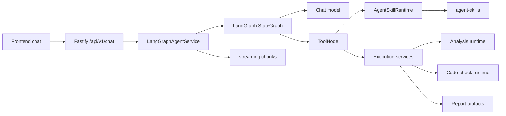

# Agent 架构

本文档描述 StructureClaw 1.0.0 当前正在运行的 agent 架构。它是面向贡献者的代码对齐参考，不是规划文档。

## 1. 运行时形态

StructureClaw 使用 capability-driven agent：

```text
前端对话界面
  -> Fastify chat API
  -> LangGraph ReAct agent
  -> 已注册 tools
  -> skill runtime 与后端执行服务
  -> 流式 assistant presentation
```

agent 不是 mode-driven。普通对话可以停留在基础 LLM 路径；工程请求则可以启用 skill 和 tool，完成草稿提取、模型校验、分析、规范校核和报告生成。



## 2. 对外入口

当前 chat routes 位于 [backend/src/api/chat.ts](../backend/src/api/chat.ts)：

- `POST /api/v1/chat/message`：同步对话执行。
- `POST /api/v1/chat/stream`：SSE 流式对话。
- `POST /api/v1/chat/stream/resume`：恢复一次暂停的交互。
- conversation snapshot 与消息持久化路由也在同一模块中。

agent capability 与 SkillHub routes 位于 [backend/src/api/agent.ts](../backend/src/api/agent.ts)：

- `GET /api/v1/agent/skills`
- `GET /api/v1/agent/tools`
- `GET /api/v1/agent/capability-matrix`
- `GET /api/v1/agent/skillhub/search`
- `GET /api/v1/agent/skillhub/installed`
- `POST /api/v1/agent/skillhub/install`
- `POST /api/v1/agent/skillhub/enable`
- `POST /api/v1/agent/skillhub/disable`
- `POST /api/v1/agent/skillhub/uninstall`
- `POST /api/v1/agent/run`

后端分析运行时入口位于 [backend/src/api/analysis-runtime.ts](../backend/src/api/analysis-runtime.ts)：

- `POST /validate`
- `POST /convert`
- `POST /analyze`
- `POST /code-check`
- `GET /schema/converters`
- `GET /engines`
- `GET /engines/:id`
- `POST /engines/:id/check`

## 3. 核心运行时文件

| 层级 | 文件 | 职责 |
|---|---|---|
| Agent service | [backend/src/agent-langgraph/agent-service.ts](../backend/src/agent-langgraph/agent-service.ts) | 创建单例 `LangGraphAgentService`，负责 streaming / synchronous / resume 入口、会话创建、checkpointer 配置和执行 client 注入。 |
| Graph | [backend/src/agent-langgraph/graph.ts](../backend/src/agent-langgraph/graph.ts) | 构建 LangGraph ReAct 循环：`START -> agent -> tools -> agent -> END`。 |
| State | [backend/src/agent-langgraph/state.ts](../backend/src/agent-langgraph/state.ts) | 定义 graph state channels，包括 messages、locale、selected skills、draft state、artifacts 与 policy。 |
| Prompt | [backend/src/agent-langgraph/system-prompt.ts](../backend/src/agent-langgraph/system-prompt.ts) | 根据已选 skill manifests 与当前 state 构建双语 system prompt。 |
| Tools | [backend/src/agent-langgraph/tools.ts](../backend/src/agent-langgraph/tools.ts) | 实现草稿提取、模型构建、校验、分析、规范校核和报告生成等工程工具。 |
| Tool registry | [backend/src/agent-langgraph/tool-registry.ts](../backend/src/agent-langgraph/tool-registry.ts) | 声明内置 tools、双语元数据、风险等级、默认启用状态与 factory。 |
| Tool policy | [backend/src/agent-langgraph/tool-policy.ts](../backend/src/agent-langgraph/tool-policy.ts) | 解析 enabled / disabled tool IDs，并在 shell gate 未开启时阻止 shell tool。 |
| User tools | [backend/src/agent-langgraph/user-tool-loader.ts](../backend/src/agent-langgraph/user-tool-loader.ts) | 加载 workspace tool 定义，并在 graph 构建时追加到 tool set。 |
| Skill runtime | [backend/src/agent-runtime/index.ts](../backend/src/agent-runtime/index.ts) | 提供 `AgentSkillRuntime`、skill 发现、manifest 列表、分析 / 规范校核 skill 选择和执行辅助函数。 |
| Skill loader | [backend/src/agent-runtime/loader.ts](../backend/src/agent-runtime/loader.ts) | 发现 skill 目录，加载阶段 Markdown，并导入可选 handler。 |
| Skill registry | [backend/src/agent-runtime/registry.ts](../backend/src/agent-runtime/registry.ts) | 按 ID、结构类型和 domain 解析 skills / plugins。 |
| Capability API | [backend/src/services/agent-capability.ts](../backend/src/services/agent-capability.ts) | 根据 skills、tools 与 engine 可用性生成前端所需 capability 元数据。 |
| Analysis execution | [backend/src/services/analysis-execution.ts](../backend/src/services/analysis-execution.ts) | 创建 agent tool layer 使用的本地分析 client。 |
| Code-check execution | [backend/src/services/code-check-execution.ts](../backend/src/services/code-check-execution.ts) | 创建 agent tool layer 使用的本地规范校核 client。 |
| Structure protocol | [backend/src/services/structure-protocol-execution.ts](../backend/src/services/structure-protocol-execution.ts) | 提供结构校验 / 转换执行辅助函数。 |

## 4. ReAct 循环

当前 graph 很小：

1. `agent` node 构建双语 system prompt，绑定 active tools，调用 chat model，并限制每轮最多 15 次 tool call。
2. `shouldContinue` 检查模型是否返回 tool calls。
3. `tools` node 将当前 graph state 注入 `config.configurable.agentState`，解析 active tools，执行 tool calls，并把 artifacts 写回 graph state。
4. 控制流回到 `agent`，直到模型不再请求 tool call。

compiled graph 在进程生命周期内缓存。skill / tool 变化后，可以通过 `LangGraphAgentService.resetGraph()` 强制重建。

## 5. 内置 Tool Set

当前内置 tool registry 定义了这些 tool IDs：

| 分类 | Tool IDs |
|---|---|
| Engineering | `detect_structure_type`, `extract_draft_params`, `build_model`, `validate_model`, `run_analysis`, `run_code_check`, `generate_report` |
| Interaction | `ask_user_clarification` |
| Session | `set_session_config` |
| Memory | `memory` |
| Workspace read | `glob_files`, `grep_files`, `read_file` |
| Workspace write | `write_file`, `replace_in_file`, `move_path` |
| Destructive workspace | `delete_path` |
| Shell | `shell` |

tool 选择是 request-scoped：

- 如果请求没有显式 enabled list，则默认启用的 tools 可用。
- `disabledToolIds` 会从 active set 中移除 tools。
- `shell` 需要 agent 配置中的 shell gate 允许。
- 未知 tool ID 会由 policy resolution 返回。

## 6. Skill 模型

Skills 是 [backend/src/agent-skills](../backend/src/agent-skills) 下的 filesystem-backed capabilities。每个 skill 由 `skill.yaml` 描述，并可包含阶段 Markdown 与可执行 handler。

最小可发现结构：

```text
backend/src/agent-skills/<domain>/<skill-id>/
  skill.yaml
  intent.md        # 可选阶段内容
  draft.md         # 可选阶段内容
  analysis.md      # 可选阶段内容
  design.md        # 可选阶段内容
  handler.ts       # 可选 TypeScript handler
  runtime.py       # 可选 Python runtime
```

运行行为由 domain 决定：

- `structure-type` skills 使用 `handler.ts` 识别结构类型、提取草稿、询问缺失信息并构建 StructureModel JSON。
- `analysis` skills 选择 OpenSees、PKPM、YJK 等后端分析 adapter。
- `code-check` skills 选择设计规范校核行为。
- 其他 domains 可能是 catalog-visible、partial wired 或 reserved。当前成熟度见 [skill-runtime-status_CN.md](./skill-runtime-status_CN.md)。

## 7. 稳定 Skill Domains

domain taxonomy 由 [backend/src/agent-runtime/types.ts](../backend/src/agent-runtime/types.ts) 中的 `ALL_SKILL_DOMAINS` 定义：

- `structure-type`
- `analysis`
- `code-check`
- `data-input`
- `design`
- `drawing`
- `general`
- `load-boundary`
- `material`
- `report-export`
- `result-postprocess`
- `section`
- `validation`
- `visualization`

taxonomy 是稳定的，但 domain 成熟度不同。domain 可以处于：

- `active`：已接入主执行路径。
- `partial`：可发现，并且部分接入运行时。
- `discoverable`：对 catalog / capability APIs 可见，但不会自动参与主 tool flow。
- `reserved`：属于 taxonomy，但当前没有内置实现。

## 8. 工程管线

当前 prompt 与 tools 会引导结构请求经过这条管线：

```text
识别结构类型
  -> 提取并合并草稿参数
  -> 必要时询问关键缺失值
  -> 构建 StructureModel
  -> 校验模型
  -> 执行分析
  -> 可选执行规范校核
  -> 生成报告
```

tools 会从 graph state 中读取 model、analysis、report 和 draft artifacts。LLM 不应该在 tools 之间传递很大的 `modelJson`、`analysisJson` 或 `stateJson` 参数。

## 9. 分析执行

分析 tool calls 通过 `AgentSkillRuntime.executeAnalysisSkill()` 和本地分析 client 执行：

```mermaid
flowchart LR
  Tool[run_analysis tool] --> Runtime[AgentSkillRuntime]
  Runtime --> Select[Selected analysis skill]
  Select --> Client[Local analysis client]
  Client --> API[/analyze]
  API --> Registry[Engine registry]
  Registry --> OpenSees[OpenSees]
  Registry --> PKPM[PKPM]
  Registry --> YJK[YJK]
  OpenSees --> Result[AnalysisResult]
  PKPM --> Result
  YJK --> Result
```

分析选择会使用请求中的 analysis type、engine ID、selected skill IDs、supported model families 以及 skill manifest 元数据。如果没有兼容的 analysis skill 被选中，runtime 不会静默挑选 engine，而会通过 tool path 返回绑定错误。

## 10. 会话状态与流式输出

`LangGraphAgentService` 创建或复用 conversation record，分配 trace ID，并通过 [backend/src/agent-langgraph/streaming.ts](../backend/src/agent-langgraph/streaming.ts) 流式输出 LangGraph 结果。chat API 会把 stream events 归约成 assistant presentation object，用于持久化和前端渲染。

Graph checkpoint 数据通过 [backend/src/agent-langgraph/file-checkpointer.ts](../backend/src/agent-langgraph/file-checkpointer.ts) 存储，路径由 [backend/src/agent-langgraph/config.ts](../backend/src/agent-langgraph/config.ts) 中的 agent 配置辅助函数解析。

## 11. 扩展边界

当前有两个扩展面：

- Skills：built-in 和 workspace skills 通过 `AgentSkillRuntime`、`AgentSkillLoader` 与 manifest validation 加载。
- Tools：built-in tools 由代码拥有；workspace tools 由 `user-tool-loader.ts` 加载，并在 graph 构建时追加到 tool registry。

高风险 tools 仍受 policy gate 约束。尤其是 shell execution，只有配置中的 shell gate 允许时才可用。

## 12. 贡献者规则

- 将本文档视为 1.0.0 实现快照。
- 不要把不存在的模块或计划中的文件写成当前架构。
- 产品行为变化时，公开文案需要保持中英文一致。
- 修改 agent 架构时，同步更新本文档和 `agent-architecture.md`。
- 新增、删除或改变 skill-domain 成熟度时，同步更新 [skill-runtime-status_CN.md](./skill-runtime-status_CN.md)。
