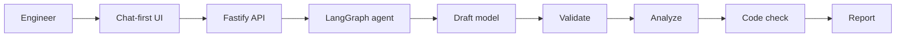
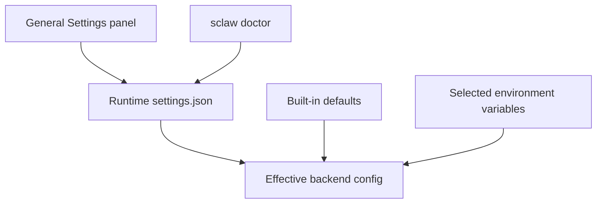
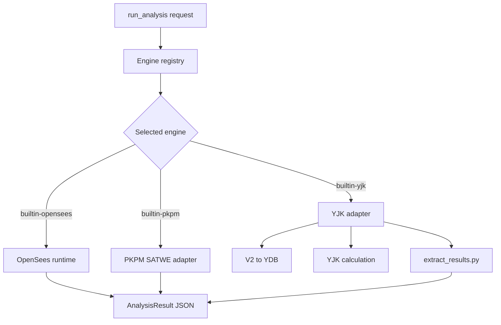

# StructureClaw Handbook

## 1. Purpose

This handbook is the practical guide for running, developing, validating, and extending StructureClaw.

Use this file for day-to-day engineering work. Use `docs/reference.md` for protocol-level details and `docs/agent-architecture.md` for the target agent architecture.

## 2. Project Scope

StructureClaw is an AI-assisted structural engineering platform with a monorepo architecture:

- `frontend`: Next.js 14 product and console UI
- `backend`: Fastify + Prisma API, agent orchestration, and the hosted Python analysis runtime

Primary workflow:

```text
natural language -> detect_structure_type -> extract_draft_params -> build_model -> validate_model -> run_analysis -> run_code_check -> generate_report
```

High-level runtime flow:



## 3. Prerequisites

Recommended installed setup:

- Node.js 20+ and npm, or the bootstrap installer in `scripts/install.sh` / `scripts/install.ps1`

Recommended source-development setup:

- Node.js 20+
- Python 3.12

## 4. Repository Structure

```text
frontend/   Next.js application
backend/    Fastify API, agent skills, hosted analysis runtime, Prisma schema, tests
scripts/    startup scripts and contract/regression validators
docs/       handbook and protocol reference
~/.structureclaw/   runtime data, logs, and generated report artifacts
```

## 5. Getting Started

### 5.0 Installed package path

For normal usage when Node.js 20+ and npm are already installed:

```bash
npm install -g @structureclaw/structureclaw
sclaw doctor
sclaw start
sclaw status
```

Installed mode runs as a single process: the backend serves the exported frontend and starts the hosted runtime services from the installed package. Runtime data is stored in the user data directory, such as `~/.structureclaw/`, not in the npm package directory.

### 5.1 Bootstrap installer path

For first-time users without Node.js, use the bootstrap installers:

```bash
curl -fsSL https://raw.githubusercontent.com/structureclaw/structureclaw/master/scripts/install.sh | bash
```

Windows PowerShell:

```powershell
irm https://raw.githubusercontent.com/structureclaw/structureclaw/master/scripts/install.ps1 | iex
```

The installers print a plan before making changes. They check for Node.js 20+ and npm. If missing or too old, they install Node.js 24 under a generic user-level Node.js directory, configure a user-local npm prefix under StructureClaw Home, install `@structureclaw/structureclaw@latest`, then run `sclaw doctor`.

In an interactive terminal, the installer first prompts for StructureClaw Home. Press Enter to keep the default, or type a path to change it before the final install plan is shown.

Default bootstrap Node.js locations:

- Windows: `%LOCALAPPDATA%\Programs\nodejs\<version>`
- Linux: `${XDG_DATA_HOME:-~/.local/share}/nodejs/<version>`

Default StructureClaw Home:

- `~/.structureclaw`
- Override with `--home <dir>` / `-Home <dir>` or `SCLAW_DATA_DIR`
- When a non-default Home is selected, the installer persists `SCLAW_DATA_DIR` for future terminals.

Useful installer options:

```bash
scripts/install.sh --skip-doctor
scripts/install.sh --cn
scripts/install.sh --registry https://registry.npmmirror.com
scripts/install.sh --node-install-parent ~/.local/share/nodejs
scripts/install.sh --home ~/.structureclaw
scripts/install.sh --yes
```

```powershell
.\scripts\install.ps1 -SkipDoctor
.\scripts\install.ps1 -Cn
.\scripts\install.ps1 -Registry https://registry.npmmirror.com
.\scripts\install.ps1 -NodeInstallParent "$env:LOCALAPPDATA\Programs\nodejs"
.\scripts\install.ps1 -Home "$HOME\.structureclaw"
.\scripts\install.ps1 -Yes
```

### 5.2 Source checkout path

For repository development:

```bash
./sclaw doctor
./sclaw start
./sclaw status
```

Source mode also uses the user runtime directory by default, such as `~/.structureclaw/`, and starts backend/frontend as development processes.

### 5.3 Node.js setup

Node.js 20+ is required for source development and direct npm installs. Install it via your preferred method (nvm, system package manager, or nodejs.org), or use the bootstrap installers above for an application install that prepares Node automatically.

### 5.4 Installed CLI lifecycle commands

```bash
sclaw logs
sclaw stop
sclaw restart
```

### 5.5 CLI alternative

```bash
./sclaw doctor
./sclaw start
./sclaw status
./sclaw logs all --follow
./sclaw stop
```

### 5.6 Windows PowerShell

```powershell
node .\sclaw doctor
node .\sclaw start
node .\sclaw status
node .\sclaw logs all --follow
node .\sclaw stop
```


### 5.7 User skills and tools

StructureClaw 1.0 supports workspace-local extension assets in the user runtime directory:

- `skills/<name>/skill.yaml` plus stage Markdown files and optional `handler.js`
- `tools/<name>/tool.yaml` plus `tool.js`

Built-in skills win on id collision. Use `sclaw doctor` or `sclaw start` to create the runtime directories automatically.

### 5.7 SkillHub CLI

Manage installable skills from the command line:

```bash
./sclaw skill list                          # list installed skills
./sclaw skill search <keyword> [domain]     # search the skill registry
./sclaw skill install <skill-id>            # install a skill
./sclaw skill enable <skill-id>             # enable an installed skill
./sclaw skill disable <skill-id>            # disable a skill
./sclaw skill uninstall <skill-id>          # uninstall a skill
```

### 5.8 China mirror CLI entrypoint

`sclaw_cn` keeps the same subcommands as `sclaw` and applies mirror defaults when not set explicitly.

```bash
./sclaw_cn doctor
./sclaw_cn setup-analysis-python
```

Default mirror values in `sclaw_cn`:

- `PIP_INDEX_URL=https://pypi.tuna.tsinghua.edu.cn/simple`
- `NPM_CONFIG_REGISTRY=https://registry.npmmirror.com`

You can override any of them in `.env` or shell environment variables.

## 6. Environment and Configuration

StructureClaw 1.0 resolves configuration in this order:

1. `settings.json` in the runtime data directory
2. Built-in defaults

Selected environment variables still act as runtime fallbacks or directory controls. `PORT`, `FRONTEND_PORT`, and `NODE_ENV` are read when the matching setting is absent, while `SCLAW_DATA_DIR` changes the runtime directory used to locate `settings.json` and data files.

The frontend General Settings panel writes `settings.json` through the backend admin API and labels each value by source (`runtime` or `default`).

Runtime data locations:

- Default: user data directory such as `~/.structureclaw/`
- Override: `SCLAW_DATA_DIR`

Configuration resolution:



Important settings sections:

- `server`: host, backend port, frontend port, body limit
- `llm`: OpenAI-compatible endpoint, model, API key, timeout, retries
- `database`: SQLite URL
- `logging`: app log level, LLM logs, rotation limits
- `analysis`: Python interpreter, timeout, engine manifest path
- `storage`: reports directory and max upload size
- `cors`: allowed origins
- `agent`: workspace root, checkpoints, shell-tool policy
- `pkpm`: `JWSCYCLE.exe` path and PKPM work directory
- `yjk`: YJK install root, `yjks.exe`, bundled Python, work directory, version, timeout, headless mode

Notes:

- `sclaw doctor` prepares the Python analysis environment. If a system Python 3.12 is missing, it ensures `uv` is available and prepares a Python 3.12 virtual environment under the user runtime directory.
- `./sclaw start` and `./sclaw restart` default to `~/.structureclaw/data/structureclaw.start.db`; `./sclaw doctor` uses `~/.structureclaw/data/structureclaw.doctor.db` so startup checks stay isolated from the active local runtime database.
- If an old local `.env` points `DATABASE_URL` at local PostgreSQL, `./sclaw doctor` and `./sclaw start` auto-migrate that data into SQLite, rewrite `.env` to the SQLite default, and keep the original PostgreSQL URL in `POSTGRES_SOURCE_DATABASE_URL`.
- Backend agent sessions and model cache use an in-memory store in the current process.
- Commercial analysis engines still require local software installation and valid licensing.

## 7. Primary Workflows

### 7.1 Chat and Agent execution

Main backend endpoints:

- `POST /api/v1/chat/message`
- `POST /api/v1/chat/stream`
- `POST /api/v1/agent/run`

Current execution chain:

`detect_structure_type -> extract_draft_params -> build_model -> validate_model -> run_analysis -> run_code_check -> generate_report`

Architecture note:

- Public product interaction uses the chat-first entry points.
- Skills and tools are optional capability layers.
- See `docs/agent-architecture.md` for the current LangGraph agent design.

### 7.2 Backend-hosted analysis runtime

Execution endpoints exposed by backend:

- `POST /validate`
- `POST /convert`
- `POST /analyze`
- `POST /code-check`
- `GET /engines`

Built-in analysis engines:

| Engine id | Software | Current role |
|---|---|---|
| `builtin-opensees` | OpenSeesPy | Default open analysis engine for static, dynamic, seismic, and nonlinear workflows |
| `builtin-pkpm` | PKPM SATWE | Commercial static-analysis path and SATWE project/result integration |
| `builtin-yjk` | YJK 8.0 | Commercial static-analysis path with YDB conversion, YJK calculation, and structured result extraction |

Analysis execution shape:



## 8. StructureModel Governance

- Required baseline: `schema_version: "1.0.0"`
- Keep strict field naming for nodes/elements/materials/sections/loads
- Always run `validate_model` before `run_analysis` / `run_code_check` where possible

## 9. Skill and No-Skill Behavior

- Skills and tools are optional capability layers, not a hard dependency for base chat.
- If no engineering skills are enabled, StructureClaw should stay on the base chat path.
- `structure-type` is the engineering entry skill domain.
- The current built-in `structure-type/generic` skill provides the generic fallback path for engineering drafts.
- New user-visible copy must be provided in both English and Chinese.

Built-in skill domains under `backend/src/agent-skills/`:

| Domain | Description |
|---|---|
| `structure-type` | Structural type recognition (beam, frame, truss, portal-frame, etc.) |
| `analysis` | OpenSees, PKPM, and YJK analysis execution |
| `code-check` | Design code compliance checking |
| `data-input` | Structured data input parsing |
| `design` | Structural design assistance |
| `drawing` | Drawing and visualization generation |
| `general` | General-purpose engineering skills and shared workflow helpers |
| `load-boundary` | Load and boundary condition handling |
| `material` | Material property management |
| `report-export` | Report generation and export |
| `result-postprocess` | Post-processing of analysis results |
| `section` | Cross-section property calculation |
| `validation` | Model validation checks |
| `visualization` | 3D model visualization |

The table above is the stable taxonomy, not a claim that every domain is fully runtime-wired today.

Current implementation maturity is tracked separately in [skill-runtime-status.md](./skill-runtime-status.md), including which domains are currently `active`, `partial`, `discoverable`, or `reserved`.

## 10. Quality and Regression

### 10.1 Backend

```bash
npm run build --prefix backend
npm run lint --prefix backend
npm test --prefix backend -- --runInBand
```

### 10.2 Frontend

```bash
npm run build --prefix frontend
npm run type-check --prefix frontend
npm run test:run --prefix frontend
```

### 10.3 Analysis runtime and contracts

```bash
node tests/runner.mjs analysis-regression
node tests/runner.mjs backend-regression
```

Useful targeted validators:

- `node tests/runner.mjs validate validate-agent-orchestration`
- `node tests/runner.mjs validate validate-agent-tools-contract`
- `node tests/runner.mjs validate validate-chat-stream-contract`
- `node tests/runner.mjs validate validate-analyze-contract`

## 11. Contributing Workflow

1. Create focused, small-scope changes.
2. Keep module boundaries intact.
3. Run targeted tests and required regression scripts.
4. Use clear conventional commit messages.
5. Document behavior changes in handbook/reference when needed.

Contribution details: `CONTRIBUTING.md`.

## 12. Troubleshooting

- If startup fails, run `./sclaw doctor` first.
- If DB-related tests fail locally, verify that `DATABASE_URL` starts with `file:` and points to a writable local path.
- If LLM flow degrades unexpectedly, confirm `LLM_BASE_URL`, `LLM_MODEL`, and API key env variables.
- If contracts fail, run the corresponding `node tests/runner.mjs validate <name>` command directly for focused diagnostics.

## 13. Related Documents

- Protocol reference: `docs/reference.md`
- Agent architecture: `docs/agent-architecture.md`
- Skill runtime status: `docs/skill-runtime-status.md`
- Chinese handbook: `docs/handbook_CN.md`
- Chinese protocol reference: `docs/reference_CN.md`
- Chinese agent architecture: `docs/agent-architecture_CN.md`
- Chinese skill runtime status: `docs/skill-runtime-status_CN.md`
- English overview: `README.md`
- Chinese overview: `README_CN.md`
