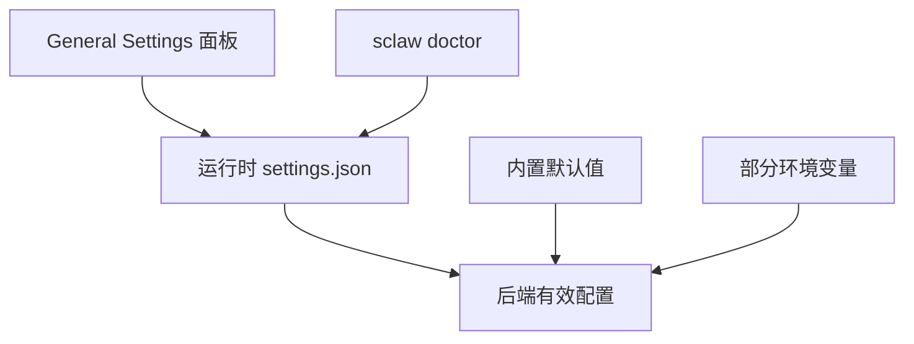
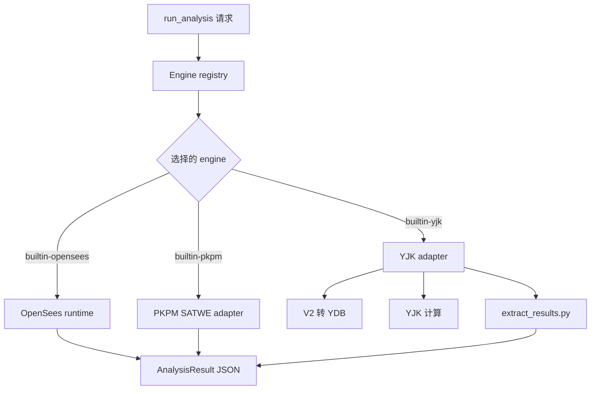

# StructureClaw 使用手册

## 1. 文档定位

本文档用于指导 StructureClaw 的运行、开发、验证与扩展。

日常工程协作请以本文档为主；协议字段与契约细节请参考 `docs/reference_CN.md`，目标 Agent 架构请参考 `docs/agent-architecture_CN.md`。

## 2. 项目范围

StructureClaw 是一个 AI 协同结构工程平台，采用单仓多服务架构：

- `frontend`：Next.js 14 前端与控制台
- `backend`：Fastify + Prisma API、Agent 编排层，以及托管式 Python 结构分析运行时

主流程：

```text
自然语言需求 -> detect_structure_type -> extract_draft_params -> build_model -> validate_model -> run_analysis -> run_code_check -> generate_report
```

高层运行流程：


## 3. 环境要求

推荐安装版环境：

- Node.js 20+ 和 npm，或使用 `scripts/install.sh` / `scripts/install.ps1` bootstrap 安装器

推荐源码开发环境：

- Node.js 20+
- Python 3.12

## 4. 仓库结构

```text
frontend/   Next.js 前端应用
backend/    Fastify API、agent skills、托管分析运行时、Prisma 模型、后端测试
scripts/    启动脚本与契约/回归校验脚本
docs/       手册与协议参考文档
~/.structureclaw/   运行数据、日志与报告工件输出目录
```

## 5. 快速上手

### 5.0 npm 安装版

如果已经安装 Node.js 20+ 和 npm，普通使用推荐全局安装：

```bash
npm install -g @structureclaw/structureclaw
sclaw doctor
sclaw start
sclaw status
```

安装版以单进程运行：backend 托管导出的 frontend，并从安装包启动托管运行时服务。运行数据写入用户数据目录，例如 `~/.structureclaw/`，不会写入 npm 包目录。

### 5.1 bootstrap 安装器

如果是没有 Node.js 的首次安装用户，使用 bootstrap 安装器：

```bash
curl -fsSL https://raw.githubusercontent.com/structureclaw/structureclaw/master/scripts/install.sh | bash
```

Windows PowerShell：

```powershell
irm https://raw.githubusercontent.com/structureclaw/structureclaw/master/scripts/install.ps1 | iex
```

安装器会先打印安装计划，再开始修改系统。它会检查 Node.js 20+ 和 npm；缺失或版本太旧时，会把 Node.js 24 安装到通用的用户级 Node.js 目录，在 StructureClaw Home 下配置用户级 npm prefix，安装 `@structureclaw/structureclaw@latest`，然后运行 `sclaw doctor`。

在交互式终端中，安装器会先询问 StructureClaw Home。直接回车保留默认值；输入路径则先修改 Home，再显示最终安装计划。

默认 bootstrap Node.js 位置：

- Windows：`%LOCALAPPDATA%\Programs\nodejs\<version>`
- Linux：`${XDG_DATA_HOME:-~/.local/share}/nodejs/<version>`

默认 StructureClaw Home：

- `~/.structureclaw`
- 可通过 `--home <dir>` / `-Home <dir>` 或 `SCLAW_DATA_DIR` 覆盖
- 选择非默认 Home 时，安装器会持久化 `SCLAW_DATA_DIR`，方便后续新终端继续使用同一目录。

常用参数：

```bash
scripts/install.sh --skip-doctor
scripts/install.sh --cn
scripts/install.sh --registry https://registry.npmmirror.com
scripts/install.sh --node-install-parent ~/.local/share/nodejs
scripts/install.sh --home ~/.structureclaw
scripts/install.sh --yes
```

```powershell
.\scripts\install.ps1 -SkipDoctor
.\scripts\install.ps1 -Cn
.\scripts\install.ps1 -Registry https://registry.npmmirror.com
.\scripts\install.ps1 -NodeInstallParent "$env:LOCALAPPDATA\Programs\nodejs"
.\scripts\install.ps1 -Home "$HOME\.structureclaw"
.\scripts\install.ps1 -Yes
```

### 5.2 源码开发版

仓库开发时使用源码目录 CLI：

```bash
./sclaw doctor
./sclaw start
./sclaw status
```

源码模式默认也使用用户运行目录，例如 `~/.structureclaw/`，并以开发进程启动 backend/frontend。

### 5.3 Node.js 安装

源码开发和直接 npm 安装需要 Node.js 20+。可通过任意方式安装（nvm、系统包管理器或 nodejs.org），如果只是应用安装，也可以使用上面的 bootstrap 安装器自动准备 Node。

### 5.4 安装版 CLI 生命周期命令

```bash
sclaw logs
sclaw stop
sclaw restart
```

### 5.5 CLI 方式

```bash
./sclaw doctor
./sclaw start
./sclaw status
./sclaw logs all --follow
./sclaw stop
```

### 5.6 Windows PowerShell

```powershell
node .\sclaw doctor
node .\sclaw start
node .\sclaw status
node .\sclaw logs all --follow
node .\sclaw stop
```


### 5.7 用户技能与工具

StructureClaw 1.0 支持在用户运行目录下放置 workspace-local 扩展资产：

- `skills/<name>/skill.yaml`，加阶段 Markdown 文件和可选 `handler.js`
- `tools/<name>/tool.yaml`，加 `tool.js`

当 id 冲突时，内置 skill 优先。`sclaw doctor` 或 `sclaw start` 会自动创建这些运行目录。

### 5.7 SkillHub CLI

通过命令行管理可安装技能：

```bash
./sclaw skill list                          # 列出已安装的技能
./sclaw skill search <keyword> [domain]     # 搜索技能仓库
./sclaw skill install <skill-id>            # 安装技能
./sclaw skill enable <skill-id>             # 启用已安装的技能
./sclaw skill disable <skill-id>            # 禁用技能
./sclaw skill uninstall <skill-id>          # 卸载技能
```

### 5.8 国内镜像 CLI 入口

`sclaw_cn` 与 `sclaw` 使用同一套子命令，并在未显式配置时自动使用国内镜像默认值。

```bash
./sclaw_cn doctor
./sclaw_cn setup-analysis-python
```

`sclaw_cn` 默认镜像配置：

- `PIP_INDEX_URL=https://pypi.tuna.tsinghua.edu.cn/simple`
- `NPM_CONFIG_REGISTRY=https://registry.npmmirror.com`

以上变量都可在 `.env` 或 shell 环境变量中覆盖。

## 6. 环境与配置

StructureClaw 1.0 按以下优先级解析配置：

1. 运行数据目录中的 `settings.json`
2. 内置默认值

部分环境变量仍会作为运行时兜底或目录控制参与解析。对应配置缺失时，后端会读取 `PORT`、`FRONTEND_PORT`、`NODE_ENV`；`SCLAW_DATA_DIR` 会改变用于查找 `settings.json` 和数据文件的运行目录。

前端 General Settings 面板通过 backend admin API 写入 `settings.json`，并标注每个值来自 `runtime` 还是 `default`。

运行数据位置：

- 默认：用户数据目录，例如 `~/.structureclaw/`
- 覆盖：`SCLAW_DATA_DIR`

配置解析流程：



重要 settings section：

- `server`：host、后端端口、前端端口、请求体大小
- `llm`：OpenAI-compatible endpoint、模型、API key、超时、重试
- `database`：SQLite URL
- `logging`：应用日志级别、LLM 日志、轮转限制
- `analysis`：Python 解释器、超时、engine manifest 路径
- `storage`：报告目录和最大上传大小
- `cors`：允许来源
- `agent`：workspace root、checkpoint、shell tool 策略
- `pkpm`：`JWSCYCLE.exe` 路径和 PKPM 工作目录
- `yjk`：YJK 安装根目录、`yjks.exe`、内置 Python、工作目录、版本、超时、headless mode

说明：

- `sclaw doctor` 会准备 Python 分析环境。如果缺少系统 Python 3.12，会先确保 `uv` 可用，并在用户运行目录下准备 Python 3.12 虚拟环境。
- `./sclaw start` 和 `./sclaw restart` 默认使用 `~/.structureclaw/data/structureclaw.start.db`；`./sclaw doctor` 使用 `~/.structureclaw/data/structureclaw.doctor.db`，确保启动预检与实际运行库隔离。
- 如果旧本地 `.env` 把 `DATABASE_URL` 指向本地 PostgreSQL，`./sclaw doctor` 和 `./sclaw start` 会自动迁移到 SQLite，改写 `.env` 为 SQLite 默认配置，并把原 PostgreSQL 地址保留到 `POSTGRES_SOURCE_DATABASE_URL`。
- 后端 agent 会话与模型缓存使用当前进程内存存储。
- 商业分析引擎仍需要本机软件安装和有效授权。

## 7. 核心工作流

### 7.1 Chat 与 Agent 执行

后端主要入口：

- `POST /api/v1/chat/message`
- `POST /api/v1/chat/stream`
- `POST /api/v1/agent/run`

当前执行链路：

`detect_structure_type -> extract_draft_params -> build_model -> validate_model -> run_analysis -> run_code_check -> generate_report`

架构说明：

- 对外产品交互使用 chat-first 入口。
- Skill 与 Tool 都属于可选能力层。
- 当前 LangGraph agent 设计见 `docs/agent-architecture_CN.md`。

### 7.2 Backend 托管分析运行时

由 backend 暴露的执行端点：

- `POST /validate`
- `POST /convert`
- `POST /analyze`
- `POST /code-check`
- `GET /engines`

内置分析引擎：

| Engine id | 软件 | 当前角色 |
|---|---|---|
| `builtin-opensees` | OpenSeesPy | 默认开源分析引擎，支持静力、动力、地震和非线性工作流 |
| `builtin-pkpm` | PKPM SATWE | 商业静力分析路径，与 SATWE 项目/结果集成 |
| `builtin-yjk` | YJK 8.0 | 商业静力分析路径，支持 YDB 转换、YJK 计算与结构化结果抽取 |

分析执行形态：



## 8. StructureModel 治理

- 必须使用 `schema_version: "1.0.0"`
- 节点/单元/材料/截面/荷载字段命名必须严格一致
- 建议先执行 `validate_model`，再执行 `run_analysis` 与 `run_code_check`

## 9. Skill 与 base chat 策略

- Skill 与 Tool 都是可选能力层，不是基础聊天的硬依赖。
- 当没有启用任何工程 skill 时，StructureClaw 应停留在 base chat 路径。
- `structure-type` 是工程入口技能域。
- 当前内置 `structure-type/generic` skill 为工程草稿提供通用兜底路径。
- 所有新增用户可见文案必须同时支持中文和英文。

内置技能域（位于 `backend/src/agent-skills/`）：

| 领域 | 说明 |
|---|---|
| `structure-type` | 结构类型识别（梁、框架、桁架、门式刚架等） |
| `analysis` | OpenSees、PKPM 与 YJK 分析执行 |
| `code-check` | 设计规范校核 |
| `data-input` | 结构化数据输入解析 |
| `design` | 结构设计辅助 |
| `drawing` | 图纸与可视化生成 |
| `general` | 通用工程技能与共享工作流辅助 |
| `load-boundary` | 荷载与边界条件处理 |
| `material` | 材料属性管理 |
| `report-export` | 报告生成与导出 |
| `result-postprocess` | 分析结果后处理 |
| `section` | 截面属性计算 |
| `validation` | 模型校验 |
| `visualization` | 三维模型可视化 |

上表表示的是稳定 taxonomy，不代表这些 domain 今天都已经完整接入运行时主流程。

当前实现成熟度请查看 [skill-runtime-status_CN.md](./skill-runtime-status_CN.md)，其中区分了哪些 domain 目前是 `active`、`partial`、`discoverable` 或 `reserved`。

## 10. 质量保障与回归

### 10.1 后端

```bash
npm run build --prefix backend
npm run lint --prefix backend
npm test --prefix backend -- --runInBand
```

### 10.2 前端

```bash
npm run build --prefix frontend
npm run type-check --prefix frontend
npm run test:run --prefix frontend
```

### 10.3 分析运行时与契约

```bash
node tests/runner.mjs analysis-regression
node tests/runner.mjs backend-regression
```

常用定向校验：

- `node tests/runner.mjs validate validate-agent-orchestration`
- `node tests/runner.mjs validate validate-agent-tools-contract`
- `node tests/runner.mjs validate validate-chat-stream-contract`
- `node tests/runner.mjs validate validate-analyze-contract`

## 11. 贡献流程

1. 变更保持小步、聚焦。
2. 严守模块边界。
3. 运行定向测试与必要回归。
4. 使用清晰的 conventional commit 信息。
5. 行为变更要同步更新手册或参考文档。

贡献细节：`CONTRIBUTING_CN.md`。

## 12. 故障排查

- 启动异常优先执行 `./sclaw doctor`。
- 数据库相关测试失败时，先检查 `DATABASE_URL` 是否以 `file:` 开头，并且指向本地可写路径。
- LLM 流程异常时，检查 `LLM_BASE_URL`、`LLM_MODEL` 与 API Key。
- 契约失败时，直接运行对应 `node tests/runner.mjs validate <name>` 进行定向诊断。

## 13. 相关文档

- 协议参考：`docs/reference_CN.md`
- Agent 架构：`docs/agent-architecture_CN.md`
- Skill 运行时状态：`docs/skill-runtime-status_CN.md`
- 英文手册：`docs/handbook.md`
- 英文协议参考：`docs/reference.md`
- 英文 Agent 架构：`docs/agent-architecture.md`
- 英文 Skill 运行时状态：`docs/skill-runtime-status.md`
- 中文总览：`README_CN.md`
- 英文总览：`README.md`
